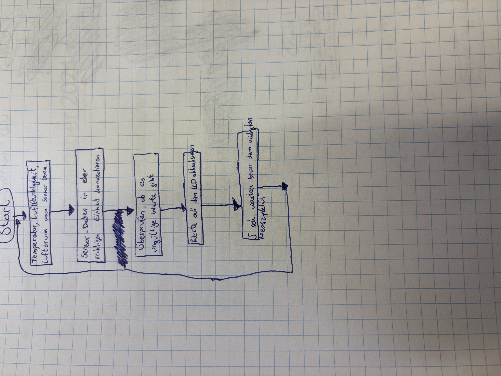
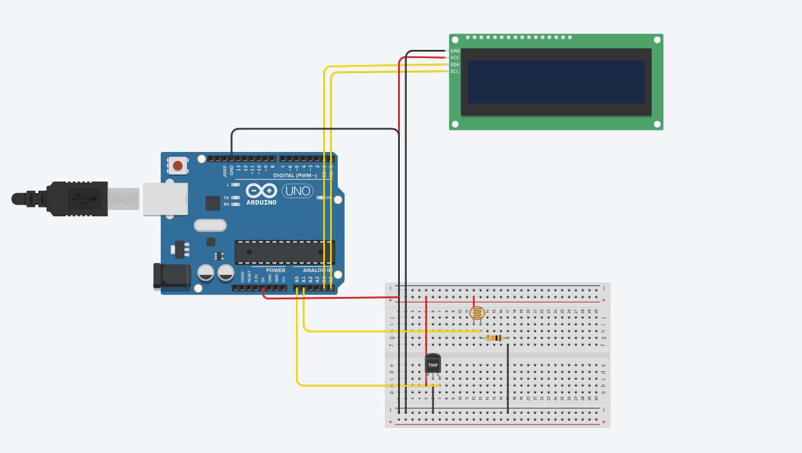
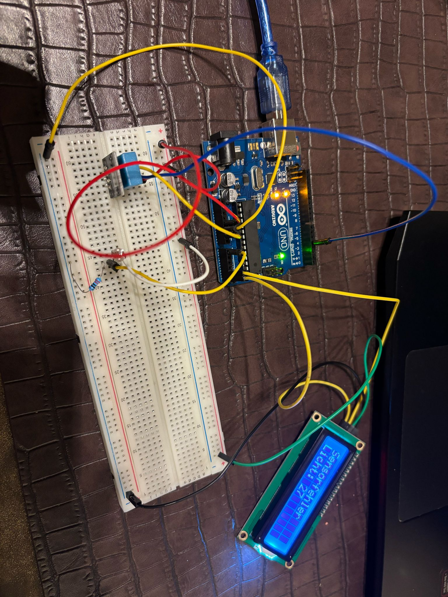

# Wetterstation

This project is a simple weather station that uses an Arduino, an LCD display, a DHT11 sensor, and a photoresistor. 
It measures temperature and humidity while also detecting light conditions. The data is displayed in real-time on the LCD screen.

Problem solved: This weather station provides basic environmental data, helping to monitor indoor or outdoor conditions. 
It allows users to easily track temperature, humidity, and light intensity without needing an internet connection.

## Flowchart

## Circuit diagram

## Photo of the final setup

## Video

It was supposed to be a weather station that, using the DHT11 sensor and a photoresistor, would measure temperature, humidity, and brightness, and then display the data on the LCD screen. The photoresistor works fine, but the DHT11 sensor does not. I also tried testing it through the Serial Monitor in the Arduino IDE, but nothing worked.

## My learnings

The project was something new for me, as I had never tried it before. The circuit setup was simple and straightforward, but the programming part was a challenge. I did my best, but unfortunately, the DHT11 sensor didn't work, and I wasn't able to display the values on the LCD screen.

## Bill of materials

 -Arduino UNO
 -Breadboard
 -LCD with L2C
 -DHT11 Sensor
 -Photoresistor

## Code

